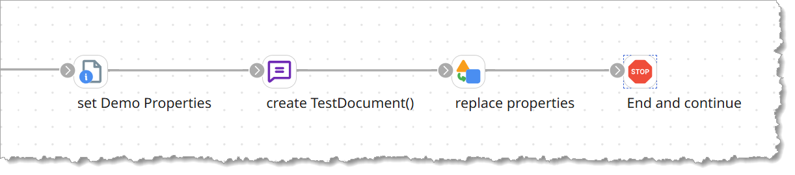
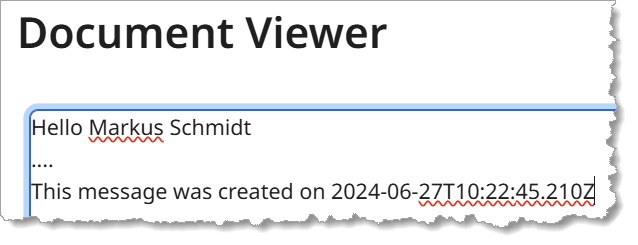

# Properties Replace

## Use-Cases

The are many use cases, when you have to **build content based on templates**. One of the most commonly used examples of this is probably the e-mail template. You have an **e-mail template** with placeholders (often stored in a *Cross Reference Lookup* component) and you have data with which you have to fill the template.

[Link to Source Code](MyScripts/src/processScript/propertiesReplace/psgpropertiesReplace.groovy)

## How it works

The *Property Replace Script* iterates through all documents taking the document as the template. It then replaces all placeholders in the document by the corresponding property value.

`{P:<dynamicProcessProperytName>}` | `{D:<dynamicDocumentProperytName>}`

### Example

Imagine, you have two Dynamic Document Properties: 

* `DDP_Firstname` = "Markus"
* `DDP_Lastname` = "Schmidt"

and you *create TestDocument()* as follows:
<sup>(Do not forget to set the quotation mark: `'`. Otherwise Boomi will try to resolve the placeholders `{}` as properties in the Message Shape.)</sup>

```
'Hello {D:DDP_Firstname} {D:DDP_Lastname}
....
This message was created on {P:UtcNow}'
```

> ### Out-Of-the box: well-known tags
>
> Please notice, the [script](MyScripts/src/processScript/propertiesReplace/psgpropertiesReplace.groovy) supports a couple of *out-of-the-box* tags, like `UtcNow`, `CurrentProcessName`, `TraceId` etc. Check the script's source-code `private String _tryGetWellKnownProperty(String propertyName) {` function. 
>
> Feel free to add more tags if you want.


