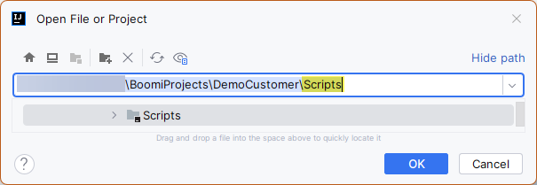

---
layout:
  title:
    visible: true
  description:
    visible: false
  tableOfContents:
    visible: true
  outline:
    visible: true
  pagination:
    visible: true
---

# 0️⃣ IntelliJ - First Time Setup

Run IntelliJ IDEA and open your first _Scripts_ project

<figure><figcaption></figcaption></figure>

IntelliJ IDEA will probably complain about not yet knowing the global libraries and SDKs.

<figure><figcaption></figcaption></figure>


<mark style="color:red;">**Do not**</mark> **click on these yellow bars!** We will setup manually!!!


### Three things to do

Configure the ATOMSphere JDK

*   Open the Module settings or press F4 \
    **Platform Settings** → **SDKs** → **+** → **Add JDK …**\

    <figure><figcaption></figcaption></figure>

<!---->

*   then add `C:\Program Files\Boomi AtomSphere\LocalAtom\jre`\
    and name it _`AtomSphere`_\

    <figure><figcaption></figcaption></figure>

Configure Groovy SDK 2.4.13

Use **Library → Create … → Choose Groovy SDK** location

Close the dialog → **OK** and stop! A project library can be used only in the current project. However, we want to use the Groovy SDK in all future projects. That's why we want to **configure it as a global library**.

Add the ATOMSphere libraries

In your Project Dialog (F4) add a **New Global Library Java** `C:\Program Files\Boomi AtomSphere\LocalAtom\lib`

Add it to all Modules

And, finally, give it a more meaningful name

<figure><figcaption></figcaption></figure>

You are ready to go with IntelliJ and you can start debugging the _HelloWorldTest_ script -> [first-steps](first-steps/ "mention")
