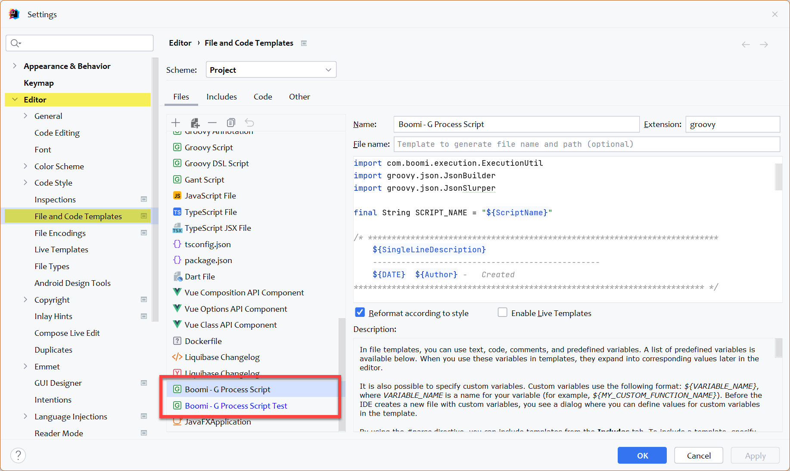

---
layout:
  title:
    visible: true
  description:
    visible: false
  tableOfContents:
    visible: true
  outline:
    visible: true
  pagination:
    visible: false
---

# IntelliJ Templates

IntelliJ supports custom file templates that you may use to simplify the creation of new Boomi and Test Scripts.

<details>

<summary>One time setup - Templates in IntelliJ</summary>

* Navigate to your _Scripts_ folder and create `.\Scripts\.idea\fileTemplates` if it does not exist.
* Download the templates from [here](https://github.com/MarkusSchmidtPro/MGF4Boomi/tree/main/src/templates) \
  or find them under `.\Scripts\lib\MGF4Boomi\templates`
  * Copy them to the `.\Scripts\.idea\fileTemplates` folder, \
    so that IntelliJ will recorgnize these files as templates.
* You must <mark style="color:red;">**restart IntelliJ**</mark> to make it aware fo the new templates.

</details>

## Using Templates


Right now, there are templates for process scripts are available, only.


### Create a new test class for a process script

Right click on any script folder where you want to create a new test class and select _Boomi - G Process Script **Test**_.

<figure><figcaption></figcaption></figure>

Fill out the neccessary information for your new test script.&#x20;

<figure><figcaption></figcaption></figure>

click OK and your blank test script is there.

<figure><figcaption></figcaption></figure>

If you look at the creates test class you can see there are predefined variables which are used to reference the process script - which will be created in a second.

```groovy
class MyFirstScript_Tests {

    final String SCRIPT_REL_DIR = 'helloWorld'
    final ProcessScript _testScript 
      = new ProcessScript("/MyFirstScript.groovy", SCRIPT_REL_DIR)
```

### Create a new process script

Right click on the folder where you created the test class and create a new process script by selecting _Boomi - G Process Script_. Fill out the neccessary information:

<figure><figcaption></figcaption></figure>

Et voilà, you're done:

<figure><figcaption></figcaption></figure>

#### Run your test&#x20;

You can _run_ the test without debugging (breakpoints won't be hit) or you use the debugger:

<figure><figcaption></figcaption></figure>

Check the output window to see the **test passed**

<figure><figcaption></figcaption></figure>

The output messages were printed by the test class (have a look into it). You are ready to implement and debug your process script. Navigate to the process script and replace the sample functionality

```groovy
// *********** Script functionality ************
// your code here...


// ******** end of Script functionality ********
```

## Manage Templates

> File → Settings ⇒ Editor → File and Code Templates

Select **Scheme : Project**

<figure><figcaption></figcaption></figure>
