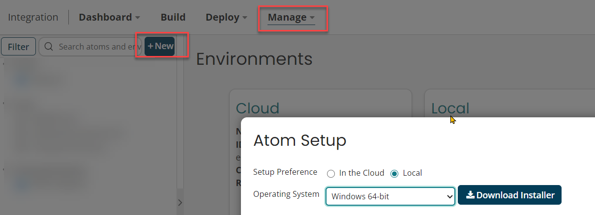
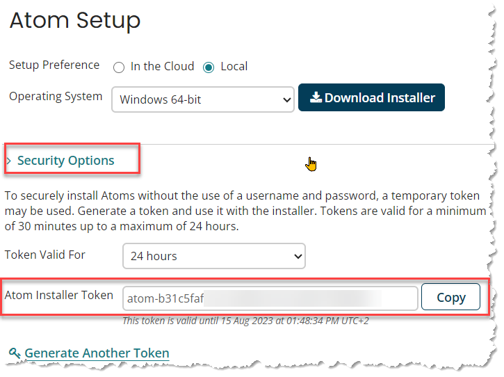

---
layout:
  title:
    visible: true
  description:
    visible: false
  tableOfContents:
    visible: true
  outline:
    visible: true
  pagination:
    visible: true
---

# Install a local ATOM

[Download and install an ATOM](https://help.boomi.com/bundle/integration/page/t-atm-Downloading\_the\_local\_Atom\_installer.html) on your local machine.

<figure><figcaption></figcaption></figure>

Do not forget to **copy your installation token**

<figure><figcaption>
You will need the installation token later
</figcaption></figure>

Chose a good installation path:


&#x20;It is very recommended you install the ATOM in this path: \
`c:\Program Files\Boomi AtomSphere\LocalAtom\`


<figure><figcaption></figcaption></figure>
