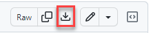
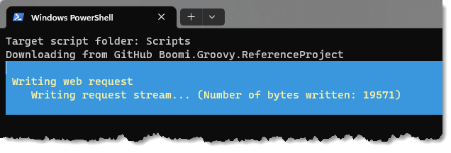

# Create a new Project

Creating a new project is as simple as **creating a folder and running a PowerShell script**.

* Use any folder for your _scripts_ project,\
  for example:  `Boomi.Spaces\MSPro\`


<mark style="color:red;">**DO NOT create your project on a Google Drive synced folder.**</mark>

G-Drive folders are not appropriate for development purposes because G-Drive keeps locks on files and folders which will lead to unpredictable results.


* [Download the **`create-project.ps1`** script from GitHub](https://github.com/MarkusSchmidtPro/Boomi.Groovy.ReferenceProject/blob/main/bin/create-project.ps1) and \
  
  * save it into you project folder.
* **Right**-**click** the script file and select _**Run with PowerShell**_

<figure><figcaption></figcaption></figure>

* After a couple of seconds \
  \
  you should have got a `Scripts` directory, ready for use.

<figure><figcaption>
Empty project directory with .idea folder
</figcaption></figure>

[using-groovy-for-boomi](using-groovy-for-boomi/ "mention")
